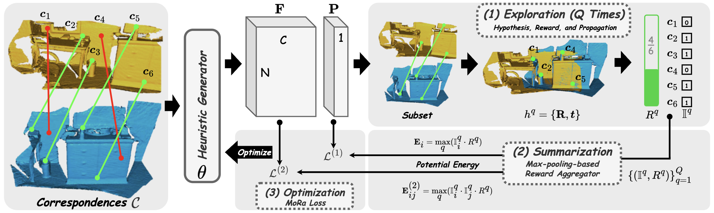

<h1 align="center">HeMoRa: Unsupervised Heuristic Consensus Sampling for Robust Point Cloud Registration</h1>

  <strong><a href="https://laka-3dv.github.io/" style="text-decoration: none; color: #555;">Shaocheng Yan</a></strong>,
  <a href="https://yimingwangmingle.github.io/bio/" style="text-decoration: none; color: #555;">Yiming Wang</a>,
  <a href="https://kaiyanzhaophoenix.github.io/bio/" style="text-decoration: none; color: #555;">Kaiyan Zhao</a>,
  <a href="https://orcid.org/0000-0003-2504-9890" style="text-decoration: none; color: #555;">Pengcheng Shi</a>,
  <a href="https://ericzzj1989.github.io/" style="text-decoration: none; color: #555;">Zhenjun Zhao</a>,
  <a href="https://skyearth.org/zhangyj/" style="text-decoration: none; color: #555;">Yongjun Zhang</a>,
  <a href="https://ljy-rs.github.io/web/" style="text-decoration: none; color: #555;">Jiayuan Li</a>

  

> **TL;DR**: HeMoRa is an unsupervised framework that learns heuristic information for better correspondence subset sampling, enabling more efficient robust transformation estimation.

## News

- *2025.02*: 🎉 HeMoRa is accepted by CVPR 2025!
